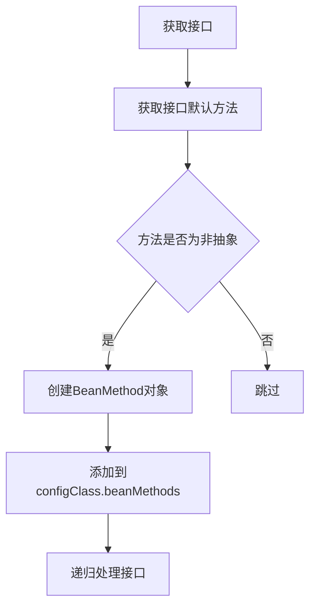
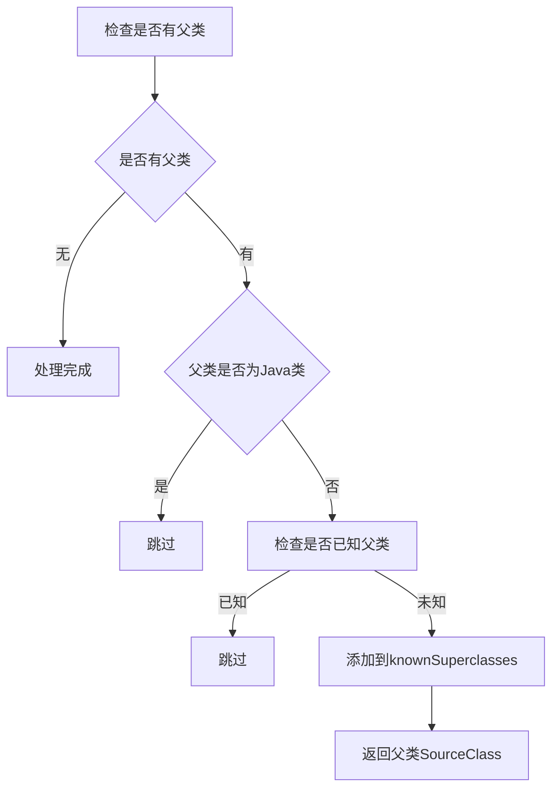

# ConfigurationClassParser注解处理流程图

## 1. 整体流程概述

ConfigurationClassParser.parse方法是Spring框架中处理配置类的核心方法，它按照特定顺序解析各种注解，并将解析结果存储在中间数据结构中，最终生成ConfigurationClass对象。

## 2. 流程图

```mermaid
graph TD
    A[开始: parse方法] --> B[遍历BeanDefinitionHolder]
    B --> C[创建ConfigurationClass对象]
    C --> D[调用processConfigurationClass]
    
    D --> E{检查条件注解}
    E -- 跳过 --> F[结束]
    E -- 继续 --> G[检查是否已处理]
    G -- 已处理 --> H[合并导入信息]
    G -- 未处理 --> I[调用doProcessConfigurationClass]
    
    I --> J[处理@Component注解]
    J --> K[处理@PropertySource注解]
    K --> L[处理@ComponentScan注解]
    L --> M[处理@Import注解]
    M --> N[处理@ImportResource注解]
    N --> O[处理@Bean方法]
    O --> P[处理接口默认方法]
    P --> Q[处理父类]
    Q --> R{是否有父类}
    R -- 有 --> S[返回父类SourceClass]
    R -- 无 --> T[处理完成]
    
    S --> I
    H --> U[将ConfigurationClass存入configurationClasses]
    U --> V[调用deferredImportSelectorHandler.process]
    V --> W[结束]
```

## 3. 各注解处理详细流程

### 3.1 @Component注解处理

```mermaid
graph TD
    A[检查@Component注解] --> B{是否为@Component}
    B -- 是 --> C[调用processMemberClasses]
    B -- 否 --> D[继续其他注解处理]
    
    C --> E[获取成员类]
    E --> F{成员类是否为配置类候选}
    F -- 是 --> G[递归处理成员类]
    F -- 否 --> H[继续其他处理]
    
    G --> I[检查循环导入]
    I -- 有循环 --> J[报错]
    I -- 无循环 --> K[调用processConfigurationClass]
    K --> L[添加到configurationClasses]
```

**中间数据存放点**：
- `configurationClasses`：存储已解析的ConfigurationClass对象
- `importStack`：跟踪导入栈，防止循环导入

### 3.2 @PropertySource注解处理

```mermaid
graph TD
    A[获取@PropertySource注解] --> B{是否有propertySourceRegistry}
    B -- 有 --> C[调用propertySourceRegistry.processPropertySource]
    B -- 无 --> D[记录忽略日志]
    
    C --> E[将属性源添加到环境]
```

**中间数据存放点**：
- `propertySourceRegistry`：存储属性源注册表
- `environment`：Spring环境对象

### 3.3 @ComponentScan注解处理

```mermaid
graph TD
    A[获取@ComponentScan注解] --> B[收集所有@ComponentScan注解]
    B --> C{是否有@ComponentScan注解}
    C -- 有 --> D[检查registerBeanConditions]
    D -- 有条件 --> E[抛出异常]
    D -- 无条件 --> F[遍历每个@ComponentScan]
    
    F --> G[调用componentScanParser.parse]
    G --> H[执行组件扫描]
    H --> I[获取扫描到的BeanDefinition]
    I --> J{BeanDefinition是否为配置类候选}
    J -- 是 --> K[递归调用parse方法]
    J -- 否 --> L[继续其他处理]
```

**中间数据存放点**：
- `scannedBeanDefinitions`：存储扫描到的Bean定义
- `componentScanParser`：组件扫描解析器

### 3.4 @Import注解处理

```mermaid
graph TD
    A[获取@Import注解] --> B[调用getImports方法]
    B --> C[收集所有导入类]
    C --> D[调用processImports方法]
    
    D --> E{是否有导入候选}
    E -- 无 --> F[返回]
    E -- 有 --> G[检查循环导入]
    G -- 有循环 --> H[报错]
    G -- 无循环 --> I[将当前配置类压入importStack]
    
    I --> J[遍历每个导入候选]
    J --> K{候选类型判断}
    
    K -- ImportSelector --> L[实例化ImportSelector]
    L --> M{是否为DeferredImportSelector}
    M -- 是 --> N[调用deferredImportSelectorHandler.handle]
    M -- 否 --> O[调用selector.selectImports]
    O --> P[递归调用processImports]
    
    K -- ImportBeanDefinitionRegistrar --> Q[实例化ImportBeanDefinitionRegistrar]
    Q --> R[调用registrar.registerBeanDefinitions]
    R --> S[将registrar添加到configClass]
    
    K -- 普通配置类 --> T[调用importStack.registerImport]
    T --> U[递归调用processConfigurationClass]
    
    P --> V[弹出importStack]
    U --> W[继续处理其他注解]
```

**中间数据存放点**：
- `importStack`：导入栈，跟踪导入关系
- `deferredImportSelectorHandler`：延迟导入选择器处理器
- `configClass.importBeanDefinitionRegistrars`：存储ImportBeanDefinitionRegistrar

### 3.5 @ImportResource注解处理

```mermaid
graph TD
    A[获取@ImportResource注解] --> B[解析资源位置]
    B --> C[解析资源读取器类]
    C --> D[遍历每个资源]
    D --> E[解析占位符]
    E --> F[将资源添加到configClass]
```

**中间数据存放点**：
- `configClass.importedResources`：存储导入的资源

### 3.6 @Bean方法处理

```mermaid
graph TD
    A[调用retrieveBeanMethodMetadata] --> B[获取所有@Bean方法]
    B --> C{方法数量>1且为StandardAnnotationMetadata}
    C -- 是 --> D[尝试通过ASM读取]
    D --> E{ASM方法数量>=反射方法数量}
    E -- 是 --> F[使用ASM方法元数据]
    E -- 否 --> G[使用反射方法元数据]
    
    F --> H[遍历每个@Bean方法]
    G --> I[创建BeanMethod对象]
    I --> J[添加到configClass.beanMethods]
```

**中间数据存放点**：
- `configClass.beanMethods`：存储@Bean方法元数据

### 3.7 接口默认方法处理



**中间数据存放点**：
- `configClass.beanMethods`：存储接口默认方法

### 3.8 父类处理



**中间数据存放点**：
- `knownSuperclasses`：存储已知的父类映射
- `importStack`：用于跟踪导入关系

## 4. 关键循环点

1. **主循环**：parse方法中的for循环，处理每个BeanDefinitionHolder
2. **递归循环**：doProcessConfigurationClass方法中的while循环，处理父类层次结构
3. **注解处理循环**：processConfigurationClass方法中的各种for循环，处理不同类型的注解
4. **导入处理循环**：processImports方法中的for循环，处理每个导入候选

## 5. 数据流转总结

1. **输入**：Set<BeanDefinitionHolder> configCandidates
2. **中间数据**：
   - `configurationClasses`：存储解析后的ConfigurationClass对象
   - `importStack`：跟踪导入关系，防止循环导入
   - `knownSuperclasses`：存储已知的父类映射
   - `propertySourceRegistry`：存储属性源注册表
3. **输出**：ConfigurationClass对象集合，包含所有解析的配置信息

这个流程图清晰地展示了ConfigurationClassParser如何处理各种注解，以及中间数据在各个处理阶段的存放点和流转过程。


