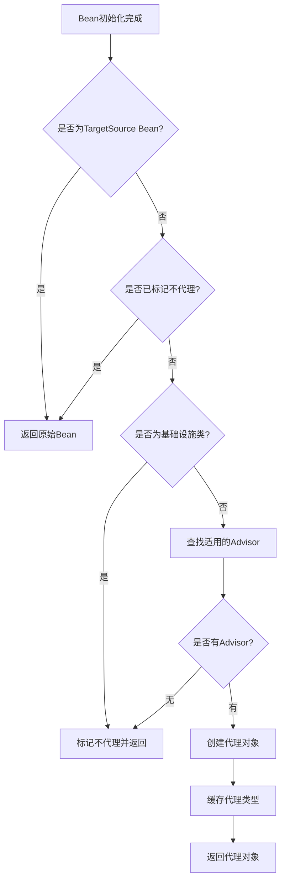
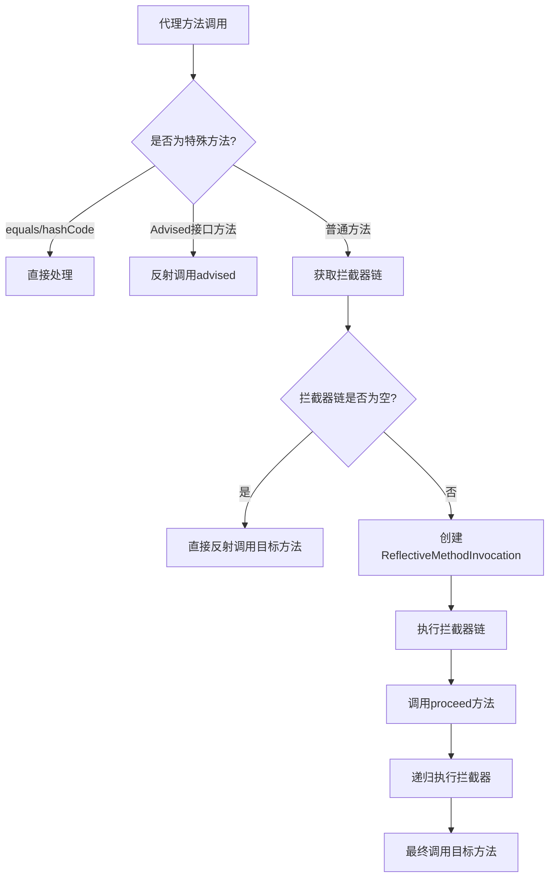

# Spring Framework深度学习第五阶段：AOP与事务管理源码全面解析

## 1. 概述

本文档基于Spring Framework源码，对AOP（面向切面编程）和事务管理的核心实现进行深度解析。通过分析源码，揭示Spring AOP的完整工作机制、代理生成原理、拦截器链执行流程以及事务管理的实现细节。

### 1.1 核心组件架构

Spring AOP的实现涉及多个核心组件，它们协同工作完成代理创建和方法拦截：

**组件层次结构**：

| 层次 | 组件 | 职责 |
|------|------|------|
| 配置层 | `@EnableAspectJAutoProxy` | AOP功能的启用入口 |
| 注册层 | `AspectJAutoProxyRegistrar` | 注册BeanPostProcessor |
| 处理层 | `AnnotationAwareAspectJAutoProxyCreator` | 自动代理创建器 |
| 构建层 | `BeanFactoryAspectJAdvisorsBuilder` | 构建Advisor |
| 工厂层 | `ProxyFactory` | 代理对象创建工厂 |
| 代理层 | `JdkDynamicAopProxy` / `CglibAopProxy` | 具体代理实现 |
| 执行层 | `ReflectiveMethodInvocation` | 拦截器链执行 |

### 1.2 学习目标

通过本阶段学习，您将：
- 理解Spring AOP的完整启动和初始化流程
- 掌握BeanPostProcessor在代理创建中的作用
- 深入了解JDK动态代理和CGLIB代理的选择策略
- 理解拦截器链的递归执行机制
- 掌握声明式事务的实现原理
- 了解事务传播行为的底层实现

## 2. AOP核心概念

### 2.1 基本概念

| 概念 | 说明 | 示例 |
|------|------|------|
| 切面（Aspect） | 横切关注点的模块化 | 日志记录、事务管理、安全检查 |
| 连接点（Join Point） | 程序执行的特定点 | 方法调用、方法执行、异常抛出 |
| 通知（Advice） | 切面在连接点执行的动作 | @Before、@After、@Around等 |
| 切点（Pointcut） | 匹配连接点的谓词表达式 | execution(* com.example..*(..)) |
| 目标对象（Target） | 被切面通知的对象 | 业务逻辑Bean |
| 代理（Proxy） | AOP创建的对象 | JDK动态代理或CGLIB代理 |
| 织入（Weaving） | 将切面应用到目标对象的过程 | 运行时织入（Spring AOP） |

### 2.2 通知类型

Spring AOP支持五种类型的通知：

| 通知类型 | 注解 | 执行时机 | 典型用途 |
|----------|------|----------|----------|
| 前置通知 | @Before | 方法执行前 | 参数校验、日志记录 |
| 后置通知 | @AfterReturning | 方法正常返回后 | 结果处理、日志记录 |
| 异常通知 | @AfterThrowing | 方法抛出异常后 | 异常处理、日志记录 |
| 最终通知 | @After | 方法执行后（无论是否异常） | 资源清理 |
| 环绕通知 | @Around | 方法执行前后 | 性能监控、事务管理 |

## 3. Spring AOP的启动与初始化

### 3.1 @EnableAspectJAutoProxy注解

**源码位置**：`org.springframework.context.annotation.EnableAspectJAutoProxy`

```java
@Target(ElementType.TYPE)
@Retention(RetentionPolicy.RUNTIME)
@Documented
@Import(AspectJAutoProxyRegistrar.class)
public @interface EnableAspectJAutoProxy {
    /**
     * 是否使用CGLIB代理而非JDK动态代理
     * true: 强制使用CGLIB代理（基于继承）
     * false: 优先使用JDK动态代理（基于接口）
     */
    boolean proxyTargetClass() default false;

    /**
     * 是否暴露代理对象到AopContext
     * true: 可通过AopContext.currentProxy()获取当前代理对象
     * false: 不暴露代理对象
     */
    boolean exposeProxy() default false;
}
```

**核心机制**：
- 通过`@Import`注解导入`AspectJAutoProxyRegistrar`
- AspectJAutoProxyRegistrar实现ImportBeanDefinitionRegistrar接口
- 在配置类解析阶段注册AOP相关的BeanDefinition

### 3.2 AspectJAutoProxyRegistrar的工作原理

**源码位置**：`org.springframework.context.annotation.AspectJAutoProxyRegistrar`

**核心职责**：
1. 注册AnnotationAwareAspectJAutoProxyCreator的BeanDefinition
2. 处理@EnableAspectJAutoProxy注解的属性配置
3. 实现自动代理创建器的升级机制

**实现细节**：

```java
class AspectJAutoProxyRegistrar implements ImportBeanDefinitionRegistrar {
    
    @Override
    public void registerBeanDefinitions(
            AnnotationMetadata importingClassMetadata, BeanDefinitionRegistry registry) {
        
        // 步骤1：注册AnnotationAwareAspectJAutoProxyCreator
        // Bean名称：org.springframework.aop.config.internalAutoProxyCreator
        AopConfigUtils.registerAspectJAnnotationAutoProxyCreatorIfNecessary(registry);
        
        // 步骤2：获取@EnableAspectJAutoProxy注解属性
        AnnotationAttributes enableAspectJAutoProxy =
                AnnotationConfigUtils.attributesFor(importingClassMetadata, EnableAspectJAutoProxy.class);
        
        if (enableAspectJAutoProxy != null) {
            // 步骤3：处理proxyTargetClass属性
            if (enableAspectJAutoProxy.getBoolean("proxyTargetClass")) {
                AopConfigUtils.forceAutoProxyCreatorToUseClassProxying(registry);
            }
            // 步骤4：处理exposeProxy属性
            if (enableAspectJAutoProxy.getBoolean("exposeProxy")) {
                AopConfigUtils.forceAutoProxyCreatorToExposeProxy(registry);
            }
        }
    }
}
```

**AutoProxyCreator升级机制**：

Spring维护了一个优先级列表，当容器中已存在自动代理创建器时，会根据优先级进行升级：

```
优先级从低到高：
1. InfrastructureAdvisorAutoProxyCreator
2. AspectJAwareAdvisorAutoProxyCreator
3. AnnotationAwareAspectJAutoProxyCreator（优先级最高）
```

### 3.3 AnnotationAwareAspectJAutoProxyCreator详解

**源码位置**：`org.springframework.aop.aspectj.annotation.AnnotationAwareAspectJAutoProxyCreator`

**类继承体系**：

```
AnnotationAwareAspectJAutoProxyCreator
  └─ AspectJAwareAdvisorAutoProxyCreator
      └─ AbstractAdvisorAutoProxyCreator
          └─ AbstractAutoProxyCreator (实现 SmartInstantiationAwareBeanPostProcessor)
              └─ ProxyProcessorSupport
                  └─ ProxyConfig
```

**关键字段**：

| 字段 | 类型 | 说明 |
|------|------|------|
| includePatterns | List&lt;Pattern&gt; | 包含的切面Bean名称模式 |
| aspectJAdvisorFactory | AspectJAdvisorFactory | AspectJ通知工厂 |
| aspectJAdvisorsBuilder | BeanFactoryAspectJAdvisorsBuilder | Advisor构建器 |

**核心方法**：

#### 3.3.1 initBeanFactory - 初始化

```java
@Override
protected void initBeanFactory(ConfigurableListableBeanFactory beanFactory) {
    super.initBeanFactory(beanFactory);
    
    // 创建ReflectiveAspectJAdvisorFactory
    // 负责从@Aspect类中解析通知方法
    if (this.aspectJAdvisorFactory == null) {
        this.aspectJAdvisorFactory = new ReflectiveAspectJAdvisorFactory(beanFactory);
    }
    
    // 创建BeanFactoryAspectJAdvisorsBuilder
    // 负责扫描和构建Advisor
    this.aspectJAdvisorsBuilder =
            new BeanFactoryAspectJAdvisorsBuilderAdapter(beanFactory, this.aspectJAdvisorFactory);
}
```

#### 3.3.2 findCandidateAdvisors - 查找候选Advisor

```java
@Override
protected List<Advisor> findCandidateAdvisors() {
    // 1. 查找Spring传统的Advisor Bean（实现Advisor接口的Bean）
    List<Advisor> advisors = super.findCandidateAdvisors();
    
    // 2. 构建@AspectJ风格的Advisor
    if (this.aspectJAdvisorsBuilder != null) {
        advisors.addAll(this.aspectJAdvisorsBuilder.buildAspectJAdvisors());
    }
    
    return advisors;
}
```

#### 3.3.3 isInfrastructureClass - 基础设施类判断

```java
@Override
protected boolean isInfrastructureClass(Class<?> beanClass) {
    // 父类判断：Advice、Pointcut、Advisor、AopInfrastructureBean
    boolean isInfrastructure = super.isInfrastructureClass(beanClass);
    
    // 判断是否为@Aspect注解的类
    boolean isAspect = (this.aspectJAdvisorFactory != null && 
                        this.aspectJAdvisorFactory.isAspect(beanClass));
    
    // 基础设施类不会被代理
    return isInfrastructure || isAspect;
}
```

### 3.4 BeanFactoryAspectJAdvisorsBuilder - Advisor构建器

**源码位置**：`org.springframework.aop.aspectj.annotation.BeanFactoryAspectJAdvisorsBuilder`

**核心职责**：扫描容器中的@Aspect Bean，并为每个通知方法构建Advisor

#### 3.4.1 buildAspectJAdvisors - 构建流程

```java
public List<Advisor> buildAspectJAdvisors() {
    List<String> aspectNames = this.aspectBeanNames;
    
    if (aspectNames == null) {
        synchronized (this) {
            aspectNames = this.aspectBeanNames;
            if (aspectNames == null) {
                List<Advisor> advisors = new ArrayList<>();
                aspectNames = new ArrayList<>();
                
                // 步骤1：获取容器中所有Bean名称
                String[] beanNames = BeanFactoryUtils.beanNamesForTypeIncludingAncestors(
                        this.beanFactory, Object.class, true, false);
                
                for (String beanName : beanNames) {
                    // 步骤2：检查Bean是否符合条件
                    if (!isEligibleBean(beanName)) {
                        continue;
                    }
                    
                    // 步骤3：获取Bean类型（不触发实例化）
                    Class<?> beanType = this.beanFactory.getType(beanName, false);
                    if (beanType == null) {
                        continue;
                    }
                    
                    // 步骤4：判断是否为@Aspect类
                    if (this.advisorFactory.isAspect(beanType)) {
                        AspectMetadata amd = new AspectMetadata(beanType, beanName);
                        
                        // 步骤5：处理单例切面
                        if (amd.getAjType().getPerClause().getKind() == PerClauseKind.SINGLETON) {
                            MetadataAwareAspectInstanceFactory factory =
                                    new BeanFactoryAspectInstanceFactory(this.beanFactory, beanName);
                            
                            // 步骤6：获取Advisor列表
                            List<Advisor> classAdvisors = this.advisorFactory.getAdvisors(factory);
                            
                            // 步骤7：缓存Advisor
                            if (this.beanFactory.isSingleton(beanName)) {
                                this.advisorsCache.put(beanName, classAdvisors);
                            } else {
                                this.aspectFactoryCache.put(beanName, factory);
                            }
                            advisors.addAll(classAdvisors);
                        }
                        // 步骤8：处理原型切面
                        else {
                            if (this.beanFactory.isSingleton(beanName)) {
                                throw new IllegalArgumentException("Bean with name '" + beanName +
                                        "' is a singleton, but aspect instantiation model is not singleton");
                            }
                            MetadataAwareAspectInstanceFactory factory =
                                    new PrototypeAspectInstanceFactory(this.beanFactory, beanName);
                            this.aspectFactoryCache.put(beanName, factory);
                            advisors.addAll(this.advisorFactory.getAdvisors(factory));
                        }
                        aspectNames.add(beanName);
                    }
                }
                this.aspectBeanNames = aspectNames;
                return advisors;
            }
        }
    }
    
    // 从缓存中获取Advisor
    if (aspectNames.isEmpty()) {
        return Collections.emptyList();
    }
    List<Advisor> advisors = new ArrayList<>();
    for (String aspectName : aspectNames) {
        List<Advisor> cachedAdvisors = this.advisorsCache.get(aspectName);
        if (cachedAdvisors != null) {
            advisors.addAll(cachedAdvisors);
        } else {
            MetadataAwareAspectInstanceFactory factory = this.aspectFactoryCache.get(aspectName);
            advisors.addAll(this.advisorFactory.getAdvisors(factory));
        }
    }
    return advisors;
}
```

**关键缓存机制**：

| 缓存 | 类型 | 说明 |
|------|------|------|
| aspectBeanNames | List&lt;String&gt; | 缓存切面Bean名称，避免重复扫描 |
| advisorsCache | Map&lt;String, List&lt;Advisor&gt;&gt; | 缓存单例切面的Advisor |
| aspectFactoryCache | Map&lt;String, MetadataAwareAspectInstanceFactory&gt; | 缓存非单例切面的工厂 |

## 4. 代理创建详解

### 4.1 AbstractAutoProxyCreator核心流程

**源码位置**：`org.springframework.aop.framework.autoproxy.AbstractAutoProxyCreator`

#### 4.1.1 postProcessAfterInitialization - 入口方法

```java
@Override
@Nullable
public Object postProcessAfterInitialization(@Nullable Object bean, String beanName) {
    if (bean != null) {
        Object cacheKey = getCacheKey(bean.getClass(), beanName);
        // 检查是否在循环依赖解决时已处理过
        if (this.earlyBeanReferences.remove(cacheKey) != bean) {
            return wrapIfNecessary(bean, beanName, cacheKey);
        }
    }
    return bean;
}
```

**触发时机**：
- Bean的所有初始化回调执行完毕后
- init-method执行后
- InitializingBean.afterPropertiesSet()执行后

#### 4.1.2 wrapIfNecessary - 核心决策逻辑

```java
protected Object wrapIfNecessary(Object bean, String beanName, Object cacheKey) {
    // 1. 检查是否为自定义TargetSource的Bean
    if (StringUtils.hasLength(beanName) && this.targetSourcedBeans.contains(beanName)) {
        return bean;
    }
    
    // 2. 检查是否已标记为不需要代理
    if (Boolean.FALSE.equals(this.advisedBeans.get(cacheKey))) {
        return bean;
    }
    
    // 3. 基础设施类和应跳过的类不代理
    if (isInfrastructureClass(bean.getClass()) || shouldSkip(bean.getClass(), beanName)) {
        this.advisedBeans.put(cacheKey, Boolean.FALSE);
        return bean;
    }
    
    // 4. 查找适用于此Bean的Advisor
    Object[] specificInterceptors = getAdvicesAndAdvisorsForBean(bean.getClass(), beanName, null);
    
    // 5. 如果有Advisor，创建代理
    if (specificInterceptors != DO_NOT_PROXY) {
        this.advisedBeans.put(cacheKey, Boolean.TRUE);
        Object proxy = createProxy(
                bean.getClass(), beanName, specificInterceptors, new SingletonTargetSource(bean));
        this.proxyTypes.put(cacheKey, proxy.getClass());
        return proxy;
    }
    
    // 6. 无Advisor，标记为不需要代理
    this.advisedBeans.put(cacheKey, Boolean.FALSE);
    return bean;
}
```

**决策流程图**：



#### 4.1.3 createProxy - 代理创建实现

```java
protected Object createProxy(Class<?> beanClass, @Nullable String beanName,
        @Nullable Object[] specificInterceptors, TargetSource targetSource) {
    
    return buildProxy(beanClass, beanName, specificInterceptors, targetSource, false);
}

private Object buildProxy(Class<?> beanClass, @Nullable String beanName,
        @Nullable Object[] specificInterceptors, TargetSource targetSource, boolean classOnly) {
    
    // 1. 暴露目标类信息（用于代理创建）
    if (this.beanFactory instanceof ConfigurableListableBeanFactory clbf) {
        AutoProxyUtils.exposeTargetClass(clbf, beanName, beanClass);
    }
    
    // 2. 创建ProxyFactory并复制配置
    ProxyFactory proxyFactory = new ProxyFactory();
    proxyFactory.copyFrom(this);  // 复制proxyTargetClass、exposeProxy等配置
    
    // 3. 决定代理接口或目标类
    if (proxyFactory.isProxyTargetClass()) {
        // 处理JDK代理和Lambda的特殊情况
        if (Proxy.isProxyClass(beanClass) || ClassUtils.isLambdaClass(beanClass)) {
            for (Class<?> ifc : beanClass.getInterfaces()) {
                proxyFactory.addInterface(ifc);
            }
        }
    } else {
        // 判断是否应该代理目标类
        if (shouldProxyTargetClass(beanClass, beanName)) {
            proxyFactory.setProxyTargetClass(true);
        } else {
            evaluateProxyInterfaces(beanClass, proxyFactory);
        }
    }
    
    // 4. 构建Advisor数组
    Advisor[] advisors = buildAdvisors(beanName, specificInterceptors);
    proxyFactory.addAdvisors(advisors);
    proxyFactory.setTargetSource(targetSource);
    customizeProxyFactory(proxyFactory);
    
    // 5. 配置代理工厂
    proxyFactory.setFrozen(this.freezeProxy);
    if (advisorsPreFiltered()) {
        proxyFactory.setPreFiltered(true);
    }
    
    // 6. 获取代理对象
    ClassLoader classLoader = getProxyClassLoader();
    if (classLoader instanceof SmartClassLoader smartClassLoader && 
            classLoader != beanClass.getClassLoader()) {
        classLoader = smartClassLoader.getOriginalClassLoader();
    }
    return (classOnly ? proxyFactory.getProxyClass(classLoader) : proxyFactory.getProxy(classLoader));
}
```

### 4.2 ProxyFactory - 代理工厂

**源码位置**：`org.springframework.aop.framework.ProxyFactory`

ProxyFactory继承自ProxyCreatorSupport，负责根据配置创建合适的AopProxy实现。

#### 4.2.1 getProxy - 创建代理对象

```java
public Object getProxy(@Nullable ClassLoader classLoader) {
    return createAopProxy().getProxy(classLoader);
}

protected final synchronized AopProxy createAopProxy() {
    if (!this.active) {
        activate();
    }
    return getAopProxyFactory().createAopProxy(this);
}
```

#### 4.2.2 DefaultAopProxyFactory - 代理选择策略

**源码位置**：`org.springframework.aop.framework.DefaultAopProxyFactory`

```java
@Override
public AopProxy createAopProxy(AdvisedSupport config) throws AopConfigException {
    // 判断是否使用CGLIB代理
    if (config.isOptimize() || 
        config.isProxyTargetClass() || 
        !config.hasUserSuppliedInterfaces()) {
        
        Class<?> targetClass = config.getTargetClass();
        
        // 无法确定目标类，抛出异常
        if (targetClass == null && config.getProxiedInterfaces().length == 0) {
            throw new AopConfigException("TargetSource cannot determine target class: " +
                    "Either an interface or a target is required for proxy creation.");
        }
        
        // 以下情况使用JDK动态代理：
        // 1. 目标类本身是接口
        // 2. 目标类是JDK代理类
        // 3. 目标类是Lambda表达式
        if (targetClass == null || 
            targetClass.isInterface() ||
            Proxy.isProxyClass(targetClass) || 
            ClassUtils.isLambdaClass(targetClass)) {
            return new JdkDynamicAopProxy(config);
        }
        
        // 使用CGLIB代理
        return new ObjenesisCglibAopProxy(config);
    }
    else {
        // 默认使用JDK动态代理
        return new JdkDynamicAopProxy(config);
    }
}
```

**代理选择决策表**：

| 条件 | 结果 |
|------|------|
| optimize = true 或 proxyTargetClass = true | CGLIB代理（除非目标是接口/代理/Lambda） |
| 目标类实现接口 且 未设置proxyTargetClass | JDK动态代理 |
| 目标类未实现接口 | CGLIB代理 |
| 目标类是接口 | JDK动态代理 |
| 目标类是Lambda | JDK动态代理 |

### 4.3 JDK动态代理实现

**源码位置**：`org.springframework.aop.framework.JdkDynamicAopProxy`

#### 4.3.1 getProxy - 创建JDK代理

```java
@Override
public Object getProxy(@Nullable ClassLoader classLoader) {
    if (logger.isTraceEnabled()) {
        logger.trace("Creating JDK dynamic proxy: " + this.advised.getTargetSource());
    }
    // 1. 获取要代理的接口
    Class<?>[] proxiedInterfaces = AopProxyUtils.completeProxiedInterfaces(this.advised, true);
    
    // 2. 查找equals和hashCode方法
    findDefinedEqualsAndHashCodeMethods(proxiedInterfaces);
    
    // 3. 使用JDK Proxy创建代理实例
    return Proxy.newProxyInstance(classLoader, proxiedInterfaces, this);
}
```

#### 4.3.2 invoke - 方法拦截实现

```java
@Override
@Nullable
public Object invoke(Object proxy, Method method, Object[] args) throws Throwable {
    Object oldProxy = null;
    boolean setProxyContext = false;
    
    TargetSource targetSource = this.advised.targetSource;
    Object target = null;
    
    try {
        // 1. 处理equals方法
        if (!this.equalsDefined && AopUtils.isEqualsMethod(method)) {
            return equals(args[0]);
        }
        // 2. 处理hashCode方法
        else if (!this.hashCodeDefined && AopUtils.isHashCodeMethod(method)) {
            return hashCode();
        }
        // 3. 处理DecoratingProxy接口方法
        else if (method.getDeclaringClass() == DecoratingProxy.class) {
            return AopProxyUtils.ultimateTargetClass(this.advised);
        }
        // 4. 处理Advised接口方法
        else if (!this.advised.opaque && method.getDeclaringClass().isInterface() &&
                method.getDeclaringClass().isAssignableFrom(Advised.class)) {
            return AopUtils.invokeJoinpointUsingReflection(this.advised, method, args);
        }
        
        Object retVal;
        
        // 5. 如果需要暴露代理，设置到AopContext
        if (this.advised.exposeProxy) {
            oldProxy = AopContext.setCurrentProxy(proxy);
            setProxyContext = true;
        }
        
        // 6. 获取目标对象
        target = targetSource.getTarget();
        Class<?> targetClass = (target != null ? target.getClass() : null);
        
        // 7. 获取拦截器链
        List<Object> chain = this.advised.getInterceptorsAndDynamicInterceptionAdvice(method, targetClass);
        
        // 8. 如果没有拦截器，直接调用目标方法
        if (chain.isEmpty()) {
            Object[] argsToUse = AopProxyUtils.adaptArgumentsIfNecessary(method, args);
            retVal = AopUtils.invokeJoinpointUsingReflection(target, method, argsToUse);
        }
        else {
            // 9. 创建MethodInvocation并执行拦截器链
            MethodInvocation invocation =
                    new ReflectiveMethodInvocation(proxy, target, method, args, targetClass, chain);
            retVal = invocation.proceed();
        }
        
        // 10. 处理返回值
        Class<?> returnType = method.getReturnType();
        if (retVal != null && retVal == target && 
            returnType != Object.class && returnType.isInstance(proxy) &&
            !RawTargetAccess.class.isAssignableFrom(method.getDeclaringClass())) {
            retVal = proxy;
        }
        else if (retVal == null && returnType != Void.TYPE && returnType.isPrimitive()) {
            throw new AopInvocationException(
                    "Null return value from advice does not match primitive return type for: " + method);
        }
        return retVal;
    }
    finally {
        if (target != null && !targetSource.isStatic()) {
            targetSource.releaseTarget(target);
        }
        if (setProxyContext) {
            AopContext.setCurrentProxy(oldProxy);
        }
    }
}
```

**方法调用流程图**：



### 4.4 CGLIB代理实现

**源码位置**：`org.springframework.aop.framework.CglibAopProxy` / `ObjenesisCglibAopProxy`

#### 4.4.1 getProxy - 创建CGLIB代理

```java
@Override
public Object getProxy(@Nullable ClassLoader classLoader) {
    if (logger.isTraceEnabled()) {
        logger.trace("Creating CGLIB proxy: " + this.advised.getTargetSource());
    }
    
    try {
        // 1. 获取目标类
        Class<?> rootClass = this.advised.getTargetClass();
        Assert.state(rootClass != null, "Target class must be available for creating a CGLIB proxy");
        
        // 2. 创建Enhancer
        Enhancer enhancer = createEnhancer();
        if (classLoader != null) {
            enhancer.setClassLoader(classLoader);
            if (classLoader instanceof SmartClassLoader &&
                    ((SmartClassLoader) classLoader).isClassReloadable(proxySuperClass)) {
                enhancer.setUseCache(false);
            }
        }
        
        // 3. 设置父类和接口
        enhancer.setSuperclass(rootClass);
        enhancer.setInterfaces(AopProxyUtils.completeProxiedInterfaces(this.advised));
        enhancer.setNamingPolicy(SpringNamingPolicy.INSTANCE);
        enhancer.setStrategy(new ClassLoaderAwareUndeclaredThrowableStrategy(classLoader));
        
        // 4. 获取回调
        Callback[] callbacks = getCallbacks(rootClass);
        Class<?>[] types = new Class<?>[callbacks.length];
        for (int x = 0; x < types.length; x++) {
            types[x] = callbacks[x].getClass();
        }
        
        // 5. 设置回调过滤器
        enhancer.setCallbackFilter(new ProxyCallbackFilter(
                this.advised.getConfigurationOnlyCopy(), this.fixedInterceptorMap, this.fixedInterceptorOffset));
        enhancer.setCallbackTypes(types);
        
        // 6. 创建代理类和实例
        return createProxyClassAndInstance(enhancer, callbacks);
    }
    catch (CodeGenerationException | IllegalArgumentException ex) {
        throw new AopConfigException("Could not generate CGLIB subclass of " + this.advised.getTargetClass() +
                ": Common causes of this problem include using a final class or a non-visible class", ex);
    }
    catch (Throwable ex) {
        throw new AopConfigException("Unexpected AOP exception", ex);
    }
}
```

#### 4.4.2 回调机制

CGLIB代理使用多个Callback来处理不同的方法调用：

| 回调类型 | 用途 |
|----------|------|
| DynamicAdvisedInterceptor | 处理普通的AOP方法拦截 |
| AdvisedDispatcher | 处理Advised接口的方法 |
| EqualsInterceptor | 处理equals方法 |
| HashCodeInterceptor | 处理hashCode方法 |
| FixedChainStaticTargetInterceptor | 处理固定拦截器链的方法（优化） |

#### 4.4.3 DynamicAdvisedInterceptor - 动态拦截器

```java
private static class DynamicAdvisedInterceptor implements MethodInterceptor, Serializable {
    
    private final AdvisedSupport advised;
    
    @Override
    @Nullable
    public Object intercept(Object proxy, Method method, Object[] args, MethodProxy methodProxy)
            throws Throwable {
        
        Object oldProxy = null;
        boolean setProxyContext = false;
        Object target = null;
        TargetSource targetSource = this.advised.getTargetSource();
        
        try {
            // 暴露代理对象
            if (this.advised.exposeProxy) {
                oldProxy = AopContext.setCurrentProxy(proxy);
                setProxyContext = true;
            }
            
            // 获取目标对象
            target = targetSource.getTarget();
            Class<?> targetClass = (target != null ? target.getClass() : null);
            
            // 获取拦截器链
            List<Object> chain = this.advised.getInterceptorsAndDynamicInterceptionAdvice(method, targetClass);
            Object retVal;
            
            // 如果没有拦截器，直接调用
            if (chain.isEmpty()) {
                Object[] argsToUse = AopProxyUtils.adaptArgumentsIfNecessary(method, args);
                retVal = AopUtils.invokeJoinpointUsingReflection(target, method, argsToUse);
            }
            else {
                // 创建MethodInvocation并执行
                retVal = new ReflectiveMethodInvocation(proxy, target, method, args, targetClass, chain).proceed();
            }
            return processReturnType(proxy, target, method, args, retVal);
        }
        finally {
            if (target != null && !targetSource.isStatic()) {
                targetSource.releaseTarget(target);
            }
            if (setProxyContext) {
                AopContext.setCurrentProxy(oldProxy);
            }
        }
    }
}
```

### 4.5 拦截器链执行机制

**源码位置**：`org.springframework.aop.framework.ReflectiveMethodInvocation`

#### 4.5.1 核心字段

```java
public class ReflectiveMethodInvocation implements ProxyMethodInvocation, Cloneable {
    
    protected final Object proxy;           // 代理对象
    
    @Nullable
    protected final Object target;          // 目标对象
    
    protected final Method method;          // 被调用的方法
    
    protected Object[] arguments;           // 方法参数
    
    @Nullable
    private final Class<?> targetClass;     // 目标类
    
    // 拦截器和动态方法匹配器列表
    protected final List<?> interceptorsAndDynamicMethodMatchers;
    
    // 当前拦截器索引，从-1开始
    private int currentInterceptorIndex = -1;
}
```

#### 4.5.2 proceed - 递归执行拦截器链

```java
@Override
@Nullable
public Object proceed() throws Throwable {
    // 1. 所有拦截器执行完毕，调用目标方法
    if (this.currentInterceptorIndex == this.interceptorsAndDynamicMethodMatchers.size() - 1) {
        return invokeJoinpoint();
    }
    
    // 2. 获取下一个拦截器（索引递增）
    Object interceptorOrInterceptionAdvice =
            this.interceptorsAndDynamicMethodMatchers.get(++this.currentInterceptorIndex);
    
    // 3. 处理动态方法匹配器
    if (interceptorOrInterceptionAdvice instanceof InterceptorAndDynamicMethodMatcher dm) {
        // 运行时匹配
        Class<?> targetClass = (this.targetClass != null ? this.targetClass : this.method.getDeclaringClass());
        if (dm.matcher().matches(this.method, targetClass, this.arguments)) {
            return dm.interceptor().invoke(this);
        }
        else {
            // 不匹配，跳过此拦截器
            return proceed();
        }
    }
    else {
        // 4. 执行拦截器
        // 拦截器会调用this.proceed()继续执行链
        return ((MethodInterceptor) interceptorOrInterceptionAdvice).invoke(this);
    }
}

@Nullable
protected Object invokeJoinpoint() throws Throwable {
    return AopUtils.invokeJoinpointUsingReflection(this.target, this.method, this.arguments);
}
```

**执行流程示意**：

```
假设拦截器链：[Interceptor1, Interceptor2, Interceptor3]

proceed() -> currentIndex=-1
  |
  +-> currentIndex=0, 执行Interceptor1.invoke(this)
        |
        +-> Interceptor1前置逻辑
        |
        +-> this.proceed() -> currentIndex=0
              |
              +-> currentIndex=1, 执行Interceptor2.invoke(this)
                    |
                    +-> Interceptor2前置逻辑
                    |
                    +-> this.proceed() -> currentIndex=1
                          |
                          +-> currentIndex=2, 执行Interceptor3.invoke(this)
                                |
                                +-> Interceptor3前置逻辑
                                |
                                +-> this.proceed() -> currentIndex=2
                                      |
                                      +-> currentIndex==size-1，调用目标方法
                                      |
                                      +-> 返回结果
                                |
                                +-> Interceptor3后置逻辑
                          |
                          +-> Interceptor2后置逻辑
              |
              +-> Interceptor1后置逻辑
```

## 5. 事务管理实现

### 5.1 TransactionInterceptor - 事务拦截器

**源码位置**：`org.springframework.transaction.interceptor.TransactionInterceptor`

TransactionInterceptor是实现声明式事务的核心拦截器，它实现了MethodInterceptor接口。

#### 5.1.1 invoke - 事务拦截实现

```java
@Override
@Nullable
public Object invoke(MethodInvocation invocation) throws Throwable {
    // 1. 获取目标类
    Class<?> targetClass = (invocation.getThis() != null ? 
            AopUtils.getTargetClass(invocation.getThis()) : null);
    
    // 2. 适配到TransactionAspectSupport的invokeWithinTransaction
    return invokeWithinTransaction(invocation.getMethod(), targetClass, invocation::proceed);
}
```

#### 5.1.2 invokeWithinTransaction - 事务执行核心

**源码位置**：`org.springframework.transaction.interceptor.TransactionAspectSupport`

```java
@Nullable
protected Object invokeWithinTransaction(Method method, @Nullable Class<?> targetClass,
        final InvocationCallback invocation) throws Throwable {
    
    // 1. 获取事务属性源
    TransactionAttributeSource tas = getTransactionAttributeSource();
    final TransactionAttribute txAttr = (tas != null ? tas.getTransactionAttribute(method, targetClass) : null);
    
    // 2. 确定事务管理器
    final TransactionManager tm = determineTransactionManager(txAttr);
    
    // 3. 处理响应式事务（WebFlux）
    if (this.reactiveAdapterRegistry != null && tm instanceof ReactiveTransactionManager rtm) {
        // ... 响应式事务处理
    }
    
    // 4. 处理命令式事务
    PlatformTransactionManager ptm = asPlatformTransactionManager(tm);
    final String joinpointIdentification = methodIdentification(method, targetClass, txAttr);
    
    if (txAttr == null || !(ptm instanceof CallbackPreferringPlatformTransactionManager)) {
        // 标准事务处理
        
        // 4.1 创建事务（如有必要）
        TransactionInfo txInfo = createTransactionIfNecessary(ptm, txAttr, joinpointIdentification);
        
        Object retVal;
        try {
            // 4.2 执行目标方法（proceed）
            retVal = invocation.proceedWithInvocation();
        }
        catch (Throwable ex) {
            // 4.3 异常时完成事务（回滚或提交）
            completeTransactionAfterThrowing(txInfo, ex);
            throw ex;
        }
        finally {
            // 4.4 清理事务信息
            cleanupTransactionInfo(txInfo);
        }
        
        // 4.5 提交事务
        commitTransactionAfterReturning(txInfo);
        return retVal;
    }
    else {
        // 编程式事务处理（回调风格）
        // ...
    }
}
```

### 5.2 事务传播行为实现

**源码位置**：`org.springframework.transaction.support.AbstractPlatformTransactionManager`

#### 5.2.1 getTransaction - 获取事务

```java
@Override
public final TransactionStatus getTransaction(@Nullable TransactionDefinition definition)
        throws TransactionException {
    
    // 1. 使用默认定义（如果未提供）
    TransactionDefinition def = (definition != null ? definition : TransactionDefinition.withDefaults());
    
    // 2. 获取事务对象
    Object transaction = doGetTransaction();
    
    // 3. 检查是否存在现有事务
    if (isExistingTransaction(transaction)) {
        // 存在现有事务，根据传播行为处理
        return handleExistingTransaction(def, transaction, debugEnabled);
    }
    
    // 4. 检查事务超时
    if (def.getTimeout() < TransactionDefinition.TIMEOUT_DEFAULT) {
        throw new InvalidTimeoutException("Invalid transaction timeout", def.getTimeout());
    }
    
    // 5. 没有现有事务，根据传播行为决定如何处理
    
    // PROPAGATION_MANDATORY: 要求必须存在事务
    if (def.getPropagationBehavior() == TransactionDefinition.PROPAGATION_MANDATORY) {
        throw new IllegalTransactionStateException(
                "No existing transaction found for transaction marked with propagation 'mandatory'");
    }
    
    // PROPAGATION_REQUIRED/PROPAGATION_REQUIRES_NEW/PROPAGATION_NESTED: 创建新事务
    else if (def.getPropagationBehavior() == TransactionDefinition.PROPAGATION_REQUIRED ||
            def.getPropagationBehavior() == TransactionDefinition.PROPAGATION_REQUIRES_NEW ||
            def.getPropagationBehavior() == TransactionDefinition.PROPAGATION_NESTED) {
        
        // 挂起空的事务
        SuspendedResourcesHolder suspendedResources = suspend(null);
        try {
            return startTransaction(def, transaction, debugEnabled, suspendedResources);
        }
        catch (RuntimeException | Error ex) {
            resume(null, suspendedResources);
            throw ex;
        }
    }
    else {
        // PROPAGATION_SUPPORTS/PROPAGATION_NOT_SUPPORTED/PROPAGATION_NEVER
        // 创建空事务
        return prepareTransactionStatus(def, null, true, newSynchronization, debugEnabled, null);
    }
}
```

#### 5.2.2 handleExistingTransaction - 处理现有事务

```java
private TransactionStatus handleExistingTransaction(
        TransactionDefinition definition, Object transaction, boolean debugEnabled)
        throws TransactionException {
    
    // 1. PROPAGATION_NEVER: 不允许存在事务
    if (definition.getPropagationBehavior() == TransactionDefinition.PROPAGATION_NEVER) {
        throw new IllegalTransactionStateException(
                "Existing transaction found for transaction marked with propagation 'never'");
    }
    
    // 2. PROPAGATION_NOT_SUPPORTED: 挂起当前事务
    if (definition.getPropagationBehavior() == TransactionDefinition.PROPAGATION_NOT_SUPPORTED) {
        Object suspendedResources = suspend(transaction);
        boolean newSynchronization = (getTransactionSynchronization() == SYNCHRONIZATION_ALWAYS);
        return prepareTransactionStatus(
                definition, null, false, newSynchronization, debugEnabled, suspendedResources);
    }
    
    // 3. PROPAGATION_REQUIRES_NEW: 挂起当前事务，创建新事务
    if (definition.getPropagationBehavior() == TransactionDefinition.PROPAGATION_REQUIRES_NEW) {
        SuspendedResourcesHolder suspendedResources = suspend(transaction);
        try {
            return startTransaction(definition, transaction, debugEnabled, suspendedResources);
        }
        catch (RuntimeException | Error beginEx) {
            resumeAfterBeginException(transaction, suspendedResources, beginEx);
            throw beginEx;
        }
    }
    
    // 4. PROPAGATION_NESTED: 嵌套事务
    if (definition.getPropagationBehavior() == TransactionDefinition.PROPAGATION_NESTED) {
        if (!isNestedTransactionAllowed()) {
            throw new NestedTransactionNotSupportedException(
                    "Transaction manager does not allow nested transactions by default - " +
                    "specify 'nestedTransactionAllowed' property with value 'true'");
        }
        if (useSavepointForNestedTransaction()) {
            // 使用SavePoint实现嵌套事务
            DefaultTransactionStatus status =
                    prepareTransactionStatus(definition, transaction, false, false, debugEnabled, null);
            status.createAndHoldSavepoint();
            return status;
        }
        else {
            // 创建嵌套事务（JTA等）
            return startTransaction(definition, transaction, debugEnabled, null);
        }
    }
    
    // 5. PROPAGATION_SUPPORTS或PROPAGATION_REQUIRED: 加入现有事务
    if (isValidateExistingTransaction()) {
        if (definition.getIsolationLevel() != TransactionDefinition.ISOLATION_DEFAULT) {
            Integer currentIsolationLevel = TransactionSynchronizationManager.getCurrentTransactionIsolationLevel();
            if (currentIsolationLevel == null || 
                    currentIsolationLevel != definition.getIsolationLevel()) {
                Constants isoConstants = DefaultTransactionDefinition.constants;
                throw new IllegalTransactionStateException("Participating transaction with definition [" +
                        definition + "] specifies isolation level which is incompatible with existing transaction: " +
                        (currentIsolationLevel != null ?
                                isoConstants.toCode(currentIsolationLevel, ISOLATION_CONSTANT_PREFIX) :
                                "(unknown)"));
            }
        }
        if (!definition.isReadOnly()) {
            if (TransactionSynchronizationManager.isCurrentTransactionReadOnly()) {
                throw new IllegalTransactionStateException("Participating transaction with definition [" +
                        definition + "] is not marked as read-only but existing transaction is");
            }
        }
    }
    boolean newSynchronization = (getTransactionSynchronization() != SYNCHRONIZATION_NEVER);
    return prepareTransactionStatus(definition, transaction, false, newSynchronization, debugEnabled, null);
}
```

### 5.3 事务传播行为总结

| 传播行为 | 有事务时 | 无事务时 | 说明 |
|----------|----------|----------|------|
| REQUIRED | 加入现有事务 | 创建新事务 | 默认行为，最常用 |
| SUPPORTS | 加入现有事务 | 非事务方式执行 | 支持但不强制事务 |
| MANDATORY | 加入现有事务 | 抛出异常 | 强制要求事务存在 |
| REQUIRES_NEW | 挂起现有事务，创建新事务 | 创建新事务 | 独立事务，互不影响 |
| NOT_SUPPORTED | 挂起现有事务，非事务执行 | 非事务方式执行 | 强制非事务 |
| NEVER | 抛出异常 | 非事务方式执行 | 禁止事务 |
| NESTED | 创建嵌套事务（SavePoint） | 创建新事务 | 外层回滚影响内层，内层回滚不影响外层 |

## 6. 架构总结与最佳实践

### 6.1 Spring AOP核心架构流程

```mermaid
graph TB
    A[@EnableAspectJAutoProxy] --> B[AspectJAutoProxyRegistrar]
    B --> C[注册AnnotationAwareAspectJAutoProxyCreator]
    C --> D[容器启动]
    D --> E[BeanFactoryAspectJAdvisorsBuilder扫描@Aspect]
    E --> F[构建Advisor列表]
    F --> G[Bean初始化完成]
    G --> H[AbstractAutoProxyCreator.postProcessAfterInitialization]
    H --> I{需要代理?}
    I -->|否| J[返回原始Bean]
    I -->|是| K[创建ProxyFactory]
    K --> L[添加Advisors]
    L --> M{代理方式?}
    M -->|JDK| N[JdkDynamicAopProxy]
    M -->|CGLIB| O[CglibAopProxy]
    N --> P[返回代理对象]
    O --> P
    P --> Q[方法调用时触发invoke]
    Q --> R[ReflectiveMethodInvocation.proceed]
    R --> S[递归执行拦截器链]
    S --> T[调用目标方法]
```

### 6.2 关键组件职责总结

| 组件 | 类型 | 职责 | 关键方法 |
|------|------|------|----------|
| @EnableAspectJAutoProxy | 注解 | AOP功能启用入口 | - |
| AspectJAutoProxyRegistrar | ImportBeanDefinitionRegistrar | 注册AutoProxyCreator | registerBeanDefinitions |
| AnnotationAwareAspectJAutoProxyCreator | BeanPostProcessor | 自动代理创建 | postProcessAfterInitialization |
| BeanFactoryAspectJAdvisorsBuilder | 构建器 | 构建Advisor | buildAspectJAdvisors |
| AbstractAutoProxyCreator | 抽象类 | 代理创建核心逻辑 | wrapIfNecessary, createProxy |
| ProxyFactory | 工厂类 | 创建AopProxy | getProxy |
| DefaultAopProxyFactory | 工厂类 | 选择代理策略 | createAopProxy |
| JdkDynamicAopProxy | AopProxy实现 | JDK动态代理 | invoke |
| CglibAopProxy | AopProxy实现 | CGLIB代理 | intercept |
| ReflectiveMethodInvocation | MethodInvocation | 执行拦截器链 | proceed |
| TransactionInterceptor | MethodInterceptor | 事务拦截 | invoke |

### 6.3 最佳实践建议

#### 6.3.1 代理方式选择

**推荐使用JDK动态代理的场景**：
- 目标对象实现了业务接口
- 面向接口编程，松耦合设计
- 不需要代理非接口方法

**推荐使用CGLIB代理的场景**：
- 目标对象未实现接口
- 需要代理所有public方法
- 使用`proxyTargetClass=true`强制CGLIB

#### 6.3.2 切面设计原则

1. **单一职责**：每个切面关注一个横切关注点
2. **明确切点**：使用精确的切点表达式，避免过度拦截
3. **性能考虑**：避免在高频方法上使用复杂的切面逻辑
4. **顺序控制**：使用@Order或Ordered接口控制切面执行顺序

#### 6.3.3 事务管理建议

1. **默认传播行为**：大多数场景使用REQUIRED即可
2. **只读事务优化**：查询方法使用`@Transactional(readOnly=true)`
3. **异常处理**：明确配置`rollbackFor`，避免checked异常不回滚
4. **事务边界**：在Service层添加事务，而非Controller或DAO
5. **避免自调用**：同一类内部方法调用不会触发事务，使用`((MyService)AopContext.currentProxy()).method()`

### 6.4 性能优化建议

1. **缓存代理对象**：Spring已实现代理缓存，避免重复创建
2. **预过滤Advisor**：使用`setPreFiltered(true)`优化拦截器链构建
3. **frozen优化**：配置固定后无需动态修改时使用`setFrozen(true)`
4. **避免过度代理**：合理使用`@EnableAspectJAutoProxy`，避免全局启用
5. **拦截器链优化**：减少不必要的拦截器，控制切面数量

## 7. 与前后阶段的关联

### 7.1 与前一阶段的联系

本阶段深度依赖第四阶段（Bean生命周期与依赖注入）的知识：
- 代理创建发生在Bean初始化后（postProcessAfterInitialization）
- 理解BeanPostProcessor机制是理解AOP的基础
- 循环依赖解决中的earlyBeanReferences与代理创建相关

### 7.2 为后一阶段奠定的基础

1. **扩展点机制**：理解BeanPostProcessor等扩展点的设计思想
2. **代理模式应用**：为理解Spring其他代理场景（如异步、缓存）做准备
3. **拦截器链模式**：责任链模式的实际应用
4. **事务管理集成**：为学习Spring与持久化框架集成做准备

## 8. 常见问题与陷阱

### 8.1 自调用问题

**问题**：同一类内部方法调用不会触发AOP

```java
@Service
public class UserService {
    @Transactional
    public void outerMethod() {
        innerMethod(); // 不会触发事务
    }
    
    @Transactional(propagation = Propagation.REQUIRES_NEW)
    public void innerMethod() {
        // ...
    }
}
```

**解决方案**：
```java
@Service
public class UserService {
    @Autowired
    private ApplicationContext context;
    
    @Transactional
    public void outerMethod() {
        UserService proxy = context.getBean(UserService.class);
        proxy.innerMethod(); // 通过代理调用
        
        // 或使用AopContext
        ((UserService)AopContext.currentProxy()).innerMethod();
    }
}
```

### 8.2 final方法无法代理

**问题**：CGLIB无法代理final方法

```java
public class MyService {
    public final void myMethod() { // CGLIB无法代理
        // ...
    }
}
```

**解决方案**：
- 移除final修饰符
- 使用接口+JDK动态代理
- 重新设计类结构

### 8.3 事务失效场景

1. **方法非public**：`@Transactional`只对public方法有效
2. **异常被捕获**：事务方法内catch异常导致不回滚
3. **异常类型不匹配**：checked异常默认不回滚
4. **数据库引擎不支持**：如MyISAM不支持事务

### 8.4 性能问题

**问题**：过度使用切面导致性能下降

**优化建议**：
- 精确定义切点表达式
- 避免在高频方法上使用复杂切面
- 使用性能分析工具识别瓶颈
- 考虑使用编译时织入（AspectJ）替代运行时织入

## 9. 源码阅读路径建议

对于深入学习Spring AOP，推荐以下源码阅读顺序：

1. **入口注解**：`@EnableAspectJAutoProxy`
2. **注册器**：`AspectJAutoProxyRegistrar`
3. **配置工具**：`AopConfigUtils`
4. **自动代理创建器**：
   - `AbstractAutoProxyCreator`
   - `AbstractAdvisorAutoProxyCreator`
   - `AnnotationAwareAspectJAutoProxyCreator`
5. **Advisor构建**：`BeanFactoryAspectJAdvisorsBuilder`
6. **代理工厂**：
   - `ProxyFactory`
   - `DefaultAopProxyFactory`
7. **代理实现**：
   - `JdkDynamicAopProxy`
   - `CglibAopProxy`
8. **方法调用**：`ReflectiveMethodInvocation`
9. **事务拦截**：`TransactionInterceptor`
10. **事务管理**：`AbstractPlatformTransactionManager`

## 10. 参考资料

- Spring Framework官方文档：AOP部分
- 《Spring源码深度解析》- 郝佳
- 《Spring揭秘》- 王福强
- AspectJ官方文档
- Spring Framework GitHub仓库

---

**文档版本**：1.0  
**更新日期**：2025-12-30  
**适用版本**：Spring Framework 6.x
